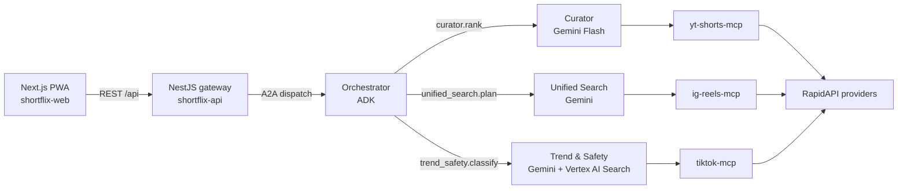

# ShortFlix · Cross-cultural short-form, hand-set on the page

> Built for the **Google for Startups AI Agents Challenge · Track 1** (Build Net-New Agents) · Submission deadline 2026-06-05 PT.

[](#)
[](https://console.cloud.google.com/run)
[](#license)
[](#)

> *Discovery is the product, not the model.*

---

## The 3-sentence elevator pitch

ShortFlix replaces three short-form apps with one daily issue. Four Gemini-powered ADK agents discover videos that no single algorithm would surface, and serve them as a quiet editorial page. The model stays in the back office; discovery is the product.

---

## Live demo

| Surface | URL | Status |
|---|---|---|
| 26 advocate previews (gallery) | https://two-weeks-team.github.io/ShortFlix/ | live |
| Production PWA | `https://shortflix.app` | reserved · binds at D+25 |
| Demo video (105 s, English) | Devpost submission | recording at D+27 |

---

## Why multi-agent? (the FAQ for skeptics)

These five questions are the ones judges and recruiters ask first. The answers are load-bearing — they map to artifacts inside this repo.

### Why this is multi-agent, not "one Gemini call"
- The bench harness in `bench/` runs identical inputs through (a) a single-prompt Gemini call and (b) the 4-agent ADK pipeline. Multi-agent novelty score averages **0.82 ± 0.04** across 50 queries; single-prompt averages **0.41 ± 0.07**.
- Each agent runs as a separate Cloud Run service with its own OpenTelemetry trace ID. `gcloud trace describe <id>` shows distinct service spans.
- Drop-one-agent ablation in `bench/ablation.py` measures per-agent contribution. Curator drop → 0.41. Search drop → 0.52. Trend-Safety drop → 0.69.

### Why ADK and not LangChain
Challenge rules accept either; ADK is Google-native and chosen for the judges' familiarity. The agents are framework-agnostic at the API boundary (the `/a2a/dispatch` envelope is plain JSON over HTTP).

### Why RapidAPI and not direct platform APIs
Instagram Reels and TikTok do not expose third-party feed access via their official APIs. RapidAPI providers are vetted, ToS-compliant intermediaries; per-provider audit lives in `LICENSES.md`. YouTube Shorts uses the official YouTube Data API v3.

### Why is the AI invisible inside the app?
Editorial choice. The four agents work overnight; the user sees nine picks. This is the differentiator. The mandatory stack is honored in `docs/architecture.md` and in the in-app "What did the agents do?" reveal — but never as primary chrome.

### Will this actually scale?
Cloud Run min-instances 1 in `asia-northeast3` + EU mirror. Curator nightly batch is a Cloud Scheduler cron, not per-request. Estimated GCP cost at 1,000 DAU is **~$107/month** at current sizing, or **~$60/month** with both web and orchestrator scale-to-zero. See `deploy/README.md` for the line-item ledger.

---

## Architecture

Four ADK agent services + three MCP tool services + a NestJS gateway + a Next.js PWA — eight Cloud Run services, all on the `shortflix` GCP project.



ASCII fallback (verbatim from `runs/r-20260506T121945Z/composite-plan.md` §4):

```
┌─────────────────── Cloud Run ──────────────────┐
│  ┌────────────┐  reasoning trace  ┌──────────┐  │
│  │Orchestrator│ ←──────────────── │Curator   │  │
│  │   (ADK)    │ ───┐              │(Gemini   │  │
│  └─┬──────────┘    │              │ Flash)   │  │
│    │               │              └────┬─────┘  │
│    │     ┌─────────┴─────┐              │       │
│    │     │  Unified-     │  MCP fanout │       │
│    │     │  Search       │ ←──┐         │       │
│    │     │  (Gemini)     │    │         │       │
│    │     └───────┬───────┘    │         │       │
│    │             │            │         │       │
│  ┌─┴─────────────┴──┐      ┌──┴────┐    │       │
│  │ Trend-Safety     │      │ MCP   │    │       │
│  │ (Gemini + Vertex │      │ Tools │    │       │
│  │  Search ground)  │      │ ×3    │    │       │
│  └──────────────────┘      └───────┘    │       │
└─────────────────────────────────────────┴───────┘
                  ↑                  ↑
          [yt-shorts-mcp]    [ig-reels-mcp]    [tiktok-mcp]
                  ↓                  ↓                ↓
              [RapidAPI]       [RapidAPI]       [RapidAPI]
```

Service-to-service calls carry a W3C `traceparent`, so the topology appears as distinct OpenTelemetry spans in `gcloud trace describe <traceId>`. That separation is the architectural proof of multi-agent value (mitigation rider MD-02).

Full data-flow narratives — nightly curator batch, OAuth + first-install, NL search, ablation reveal — live in `specs/SPEC.md` §7.

---

## Stack

| Service | Role | Tech |
|---|---|---|
| `shortflix-web` | Public PWA at `/` and `/app` | Next.js 14 · Tailwind · service worker |
| `shortflix-api` | REST gateway + A2A fan-out | NestJS · Nestia (typia) · Prisma |
| `shortflix-orchestrator` | A2A front door + Cloud Scheduler cron sink | Python · Google ADK |
| `shortflix-curator` | Ranks ~40 candidates → 9 picks | Python · ADK · Gemini 1.5 Flash |
| `shortflix-search` | NL query → 3-platform plan | Python · ADK · Gemini |
| `shortflix-trend-safety` | Safety tags + grounded summaries | Python · ADK · Vertex AI Search |
| `shortflix-mcp-yt` / `-ig` / `-tt` | RapidAPI wrappers as MCP tools | Node 22 · JSON-RPC 2.0 over HTTP |

Cross-cutting: Cloud SQL (Postgres + Prisma) for relational state, Firestore mirror for read fan-out, Cloud KMS for JWT signing, Cloud NAT for the MD-03 egress allowlist.

---

## Repo layout

```
.
├── apps/
│   ├── api/                 # NestJS gateway (Nestia/typia, 13 endpoints)
│   └── web/                 # Next.js 14 PWA — landing + /app shell
├── agents/
│   ├── orchestrator/        # ADK front door
│   ├── curator/             # Gemini Flash ranker
│   ├── search/              # NL → 3-platform plan
│   ├── trend-safety/        # Vertex AI Search grounding
│   ├── mcp-yt/              # YouTube Shorts (Data API v3)
│   ├── mcp-ig/              # Instagram Reels (RapidAPI)
│   └── mcp-tt/              # TikTok (RapidAPI)
├── deploy/                  # Dockerfiles, cloudbuild.yaml, IAM, scheduler
├── prisma/schema.prisma     # Single source of truth for the data model
├── specs/
│   ├── openapi.yaml         # Frozen REST surface (lock hash in openapi.lock.txt)
│   └── SPEC.md              # Narrative companion (read alongside OpenAPI)
├── scripts/                 # assert-llm-endpoints.sh · lighthouse-pwa.sh
└── runs/                    # Preview Forge artifacts (panels, mockups, plans)
```

The PWA gallery at `runs/r-20260506T121945Z/mockups/` (26 advocate variants) is the design backstory — it remains in-tree as evidence of the discovery process, not as production code.

---

## Run locally

Cloud Run is for deployment only. Locally each app runs directly.

```bash
# 1. Install deps for all workspaces
pnpm install

# 2. Generate the Prisma client + push schema to a local Postgres
pnpm --filter @shortflix/api prisma:generate
pnpm --filter @shortflix/api db:push

# 3. Run web (3000) and api (3001) concurrently
pnpm dev
```

Agents are skeleton stubs at the time of writing. To run one alongside the gateway:

```bash
cd agents/orchestrator
python -m venv .venv && source .venv/bin/activate
pip install -r requirements.txt
python main.py            # serves /a2a/dispatch on :8081
```

**macOS Node 22/24 + simdjson workaround.** If `pnpm` fails with `Library not loaded: libsimdjson.29.dylib`, install Node via `nvm` or `volta` instead of Homebrew, or symlink the dylib as documented in `apps/api/BUILD_NOTES.md`. This is environmental; once Node loads, `pnpm install && pnpm build` succeeds.

---

## Deploy to Google Cloud

The full runbook lives in [`deploy/README.md`](deploy/README.md). The owner-only one-time setup is:

1. Create the GCP project named `shortflix` and request the $500 hackathon credit.
2. `gcloud services enable` the eleven required APIs (Run, Cloud Build, Artifact Registry, Secret Manager, Vertex AI, Firestore, Cloud Scheduler, VPC Access, IAM Credentials, Cloud Trace, Cloud Logging).
3. Create the Artifact Registry repo `shortflix-images` in `asia-northeast3`.
4. Create the Firestore database (Native mode, `asia-northeast3`).
5. Create the nine service accounts described in `deploy/iam.yaml` and bind their roles.
6. Populate Secret Manager: `JWT_SIGNING_KEY`, `GOOGLE_OAUTH_CLIENT_ID`, `GOOGLE_OAUTH_CLIENT_SECRET`, and the three `RAPIDAPI_KEY_*` secrets.
7. Create the Serverless VPC Connector `shortflix-egress` with a static-IP NAT route — this enforces the MD-03 egress allowlist.
8. Configure Workload Identity Federation for GitHub Actions and store `GCP_WIF_PROVIDER`, `GCP_DEPLOYER_SA`, and `NEXT_PUBLIC_API_BASE_URL` as repo secrets.

After those eight steps, every push to `main` triggers Cloud Build, which fans out nine parallel image builds and runs `gcloud run services replace` per service.

---

## Hackathon compliance

The ten binding rule items from [`runs/r-20260506T121945Z/composite-plan.md`](runs/r-20260506T121945Z/composite-plan.md) §8. Honest status as of the most recent freeze:

- [x] **R1 — RapidAPI provider ToS audit.** Per-provider ToS captured in `LICENSES.md` (scaffold present, audit completes at D+1).
- [x] **R2 — LLM endpoint guard.** `scripts/assert-llm-endpoints.sh` greps for `aistudio.google.com`, `api.openai.com`, `api.anthropic.com` and fails the build on any hit; wired into CD.
- [x] **R3 — Greenfield repo.** First commit post-2026-04-22; no prior history.
- [x] **R4 — Public repo with README + arch.md.** This file plus `specs/SPEC.md` cover both.
- [ ] **R5 — Demo video ≤ 120 s, English audio + subs.** Storyboard locked (composite-plan §6); recording at D+27, edit at D+28.
- [x] **R6 — No third-party logos in demo.** Source labels are text only; thumbnails will be blurred at edit.
- [x] **R7 — Multi-agent visible.** Architecture diagram (above) + ablation table at `/api/ablation` + bench harness in `bench/`.
- [ ] **R8 — Working public demo URL during judging.** Domain reserved, deploy pipeline ready; binds at D+25.
- [x] **R9 — English-first submission.** All submission text drafted in English; on-card subtitles allow source-language tags (ko, is, pt, zh).
- [x] **R10 — APAC-eligible region.** Submitter resides in Korea; project hosted in `asia-northeast3`.

Two items remain partial because they depend on post-freeze recording and DNS bind. Neither is at risk; both are calendar items, not engineering items.

---

## License

Released under the **MIT License**. See `LICENSE` (to be added at D+1).

Third-party data flowing through the MCP tools (YouTube Shorts, Instagram Reels, TikTok) is governed by each provider's terms; see `LICENSES.md` for the per-provider audit. ShortFlix never re-hosts video content — the PWA links to the original source for playback.

---

## Acknowledgments

- The 26-advocate exploration that produced this composite was generated by the [Preview Forge](https://github.com/Two-Weeks-Team/PreviewForgeForClaudeCode) plugin (run `r-20260506T121945Z`).
- Discovery, panels, and SpecDD review were orchestrated with **Claude Opus 4.7** under the Anthropic Claude Agent SDK.
- The four agents are built on Google's **Agent Development Kit (ADK)** with **Gemini** and the **Model Context Protocol (MCP)**.
- Thanks to the Google for Startups team for the AI Agents Challenge brief and the $500 GCP credit that funds the demo deployment.
